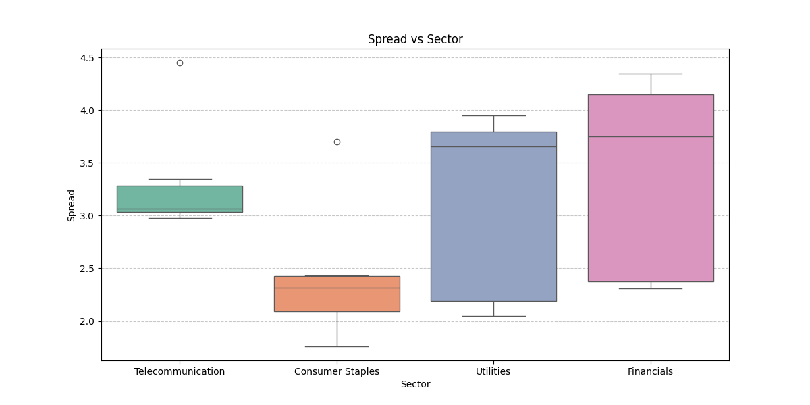
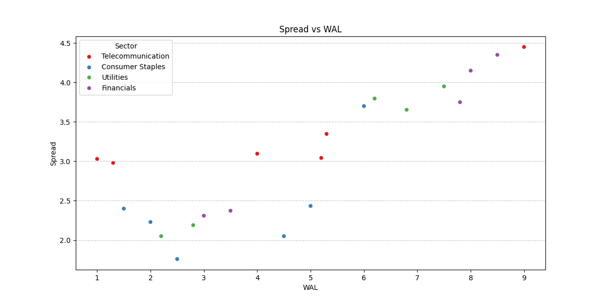

# Analysis Results

## Spread vs Sector

## Spread vs WAL

## Model Evaluation

### Logistic Regression
- Accuracy: 0.90
- Precision: 0.78
- Recall: 0.75
- F1 Score: 0.76

### Random Forest
- Accuracy: 0.93
- Precision: 0.90
- Recall: 0.76
- F1 Score: 0.82

